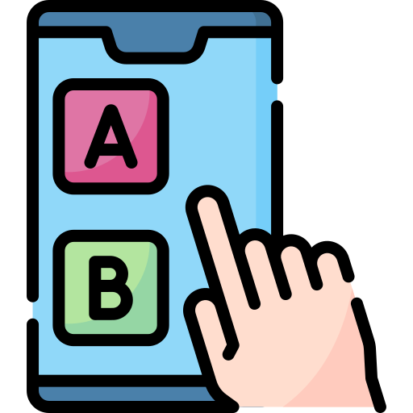
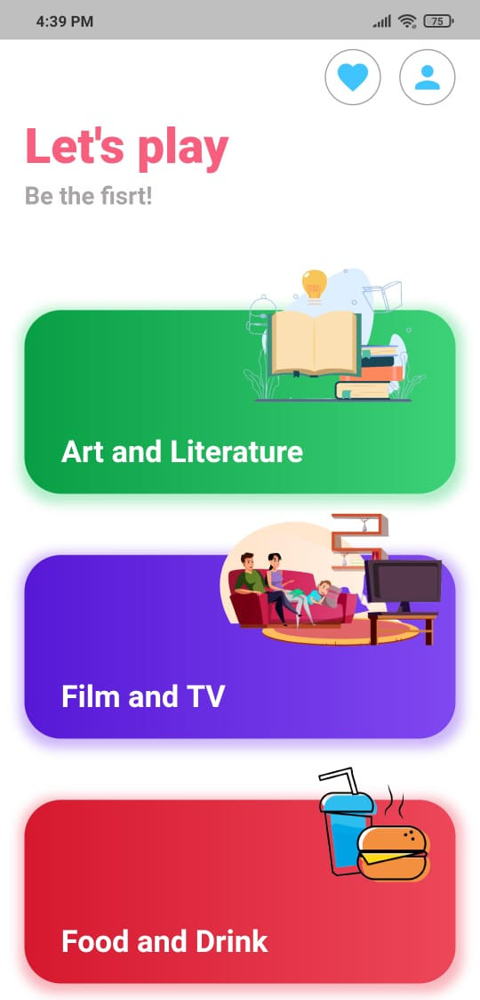
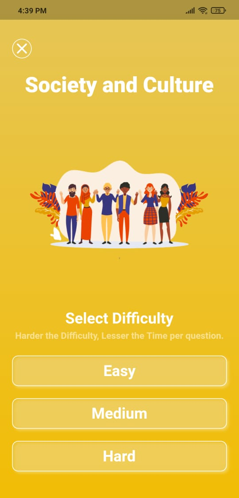
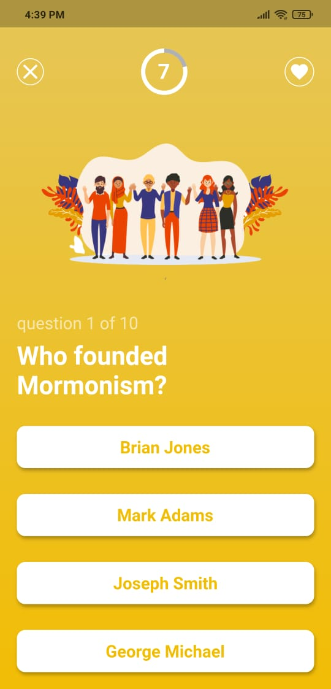

<h1 align="center">
  
   
     
   
    📱 Quizler 📱
   
</h1>

<h4 align="center">A simple yet beautiful Quiz app with multiple categories built on top of <a href="https://flutter.dev/" target="_blank" style="color:##0276E8;">Flutter</a>.</h4>
 

##  About this project
This repository holds my very fisrt project built with flutter. Purpose of this project is to learn new concepts in flutter.

Quizler is a quiz game app which retrieve questions from <a href="https://the-trivia-api.com/" target="_blank" style="color:##0276E8;">The Trivia API</a>. It has questions in multiple category and with difficulty options.

## Screenshots
    

## Dependencies used
<a href="https://the-trivia-api.com/" target="_blank" style="color:##0276E8;">The Trivia API</a> 
<a href="https://pub.dev/packages/http" target="_blank" style="color:##0276E8;">http</a>

